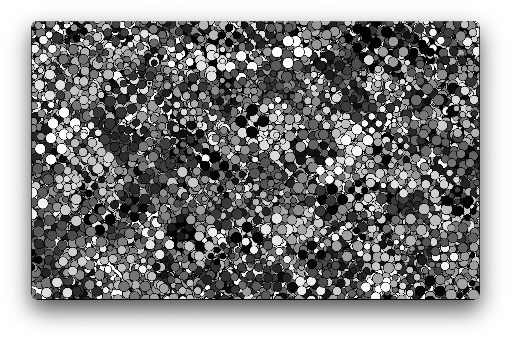

# Tronco sobre espejo
14 de Marzo de 2021

## commit -m
```
Mi primer obra al estar aprendiendo P5!

Me había dado curiosidad el mundo de el arte digital desde hace tiempo,
en Japón llegué a ver muchas propuestas ya bastante evolucionadas,
en especial tras ir a un evento de live coding en Ciudad de México.

Intenté con hidra, de Flor de Fuego, pero no pude,
se lo atribuyo a mi forma arcarica de aprender programación,
necesito estructura del lenguaje un poco mas familar a las matematicas,
supongo que por viejo.

Así que muy a la antigua, 
me compré el mejor libro sobre el que encontré referencias,
y pues empecé a darle.
[Generative gestaltung](http://www.generative-gestaltung.de)

Solo que el pinche libro tambien esta hecho para artistas,
esa gente parece tener una logica diferente,
mi cerebro cuadrado necesita de una estructura para poder aprender,
entonces iré haciendome mi propia guia,
documentar lo que voy aprendiendo,
y pues dejarlo al mundo por si a alguien mas le sirve mi guía,
de seguro habrá otro menso como yo que no le entienda a los libros para artistas.
```

## v1

[Código fuente](https://github.com/tovVAar/p5Learning/tree/main/scripts)